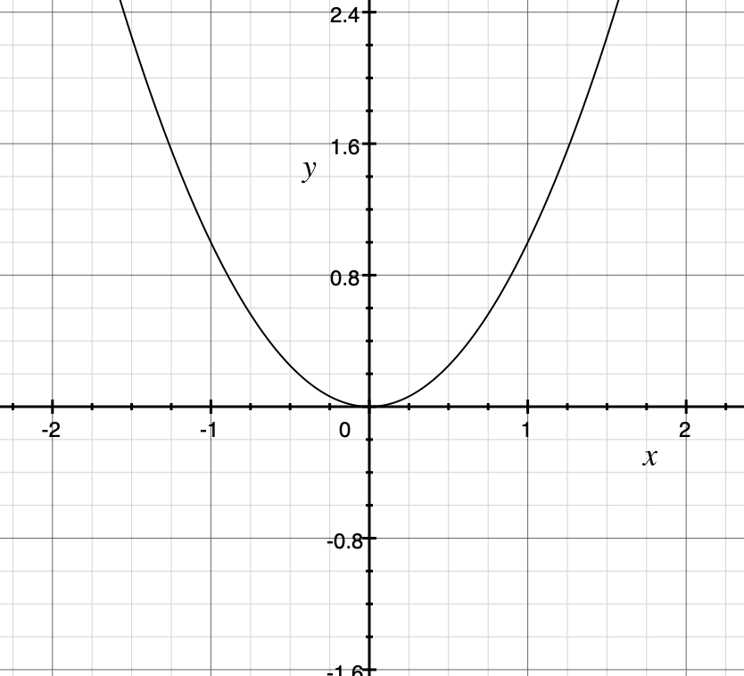

# Functions

Functions are one of the basic unit of composition in JavaScript. When building a FP, we use functions as a primary unit of composition. Therefore, we are going to talk about functions.

## Mathematical functions

The notion of functions starts from mathematics. Let's take one of the simplest function <code>f(x) = x2 </code>. Here is the graph of this equation

    

What this graph describes is for a given input, a value in horizontal axis `x-value`, what is the output, another value in vertical axis `y-value`. Here is what the value looks like

| x-value | y-value |
| :-----: | :-----: |
|   -2    |    4    |
|   -1    |    1    |
|    0    |    0    |
|    1    |    1    |
|    2    |    4    |

We could say that for a given input (x-value), the function `map's` it to some output (y-value). The choice of the word map is intentional.

> Function's map an input value to output value.

[Work in progress]