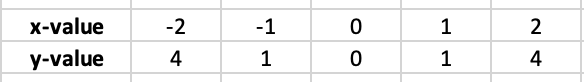

# Functions

Functions are one of the basic unit of composition in JavaScript. When building a FP, we use functions as a primary unit of composition. Therefore, we are going to talk about functions.


## Mathematical functions

The notion of functions starts from mathematics. Let's take one of the simplest equation - aka function, <code>f(x) = x<sup>2</sup> </code>. Here is the graph of this function

<p align="center">
    
</p>

What this graph describes is for a given input, a value in horizontal axis `x-value`, what is the output, another value in vertical axis `y-value`. We can represent this in tabular format for few data points as

<p align="center">
    
</p>

We could say that for a given input (x-value), the function `map's` it to some output (y-value). The choice of the word map is intentional.

> Function's map an input value to output value.

## JavaScript functions

We could write a program in JavaScript that will compute an output value for a given input value for the equation <code>f(x) = x<sup>2</sup> </code>.

```js
function square(x) {
  return x * x;
}
```

Using the data points from tabular format, we could write a complete program that makes use of `square` function as:

```js
function square(x) {
  return x * x;
}

var xValue = [-2, -1, 0, 1, 2];

var yValue = xValue.map(square);

console.log(yValue); // output: [ 4, 1, 0, 1, 4 ]
```

Notice the use of `map` method which is part of JavaScript Array. The `map` method accepts a function as input and then uses this function to **map** each element into an output. In FP we need to embrace this mathematical notion of function -  _to map an input to output_.

> Functions are used for _mapping_ input value to output 


## Higher order functions

Did you know that functions in JavaScript are referred to as first class citizen? What does it mean to be a first class citizen?

To explain that let's think about other data types in JavaScript, for example string or a number. You can assign string to a variable; you can pass a string as an argument to a function; a function may even return an string etc. You can do the same thing with function i.e. assign a function variable; pass a function as an argument to another function; return a function from a function. This means that a function is treated like any other variable. This is what it means to be a first class citizen - to be treated same as other variables.

> Functions are treated just like any other values in JavaScript.

A function that takes function as a parameter and/or returns function as value are known as **higher order functions**. Because function's are first class citizen in JavaScript, we can create a higher order functions. Our first encounter with higher order function was in chapter 1 where we implemented the functional version of [`pickAttribute`](../1/ch1.md#fppickattr) function.

By using higher order function we can abstract action over some values. Let's look at simple higher order function

```js
function greaterThen(m) {
  return function greaterThenHelper(n) {
    return m > n;
  };
}

const greaterThen15 = greaterThen(15);

console.log(greaterThen15(10)); // false
console.log(greaterThen15(20)); // true
```

Here is another example of a function that can greet in multiple languages:

```js
function getGreeting(lang) {
  switch (lang) {
    case 'np':
      return 'नमस्ते';

    case 'en':
    default:
      return 'Hello';
  }
}

function greetPerson(greet, language = 'en') {
  return function(name) {
    return `${greet(language)} ${name}`;
  };
}

const greetInNepali = greetPerson(getGreeting, 'np');

console.log(greetInNepali('Sagar'));
console.log(greetInNepali('Jason'));
```

Using a higher order function, we have created new function `greetInNepali` which can greet any person in Nepali. Similarly, we can also create another function which can greet in english.


[Work in progress]